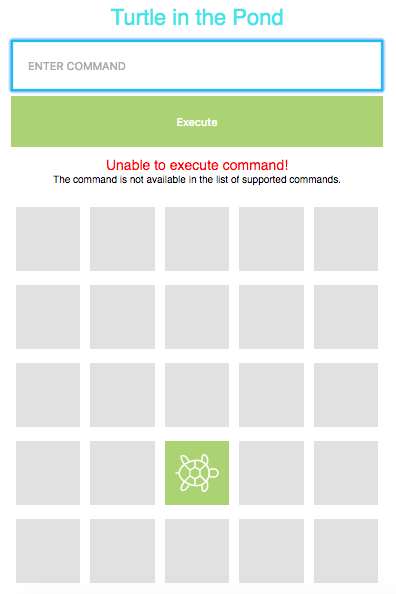

# Turtle-in-the-Pond

A simple project that simulates the basic movement of a turtle in the pond

Created using: HTML5, CSS3, Javascript/JQuery

The turtle will listen to the command entered in the textbox or by using the keyboad

Available commands:
 PLACE X,Y,DIRECTION | Clicking on a cell
 -place the turtle in the given x and y coordinate facing the direction (i.e. NORTH, EAST, SOUTH, WEST)

MOVE | pressing UP arrow key
 -move the turtle one cell towards the direction it is facing

RIGHT | pressing RIGHT arrow key
 -turn the turtle 90 degrees to its right

LEFT | pressing LEFT arrow key
 -turn the turtle 90 degrees to its left

REPORT | pressing DOWN arrow key
 -log the x and y coordinates and the direction of the turtle in the browser console

Screenshots:  

